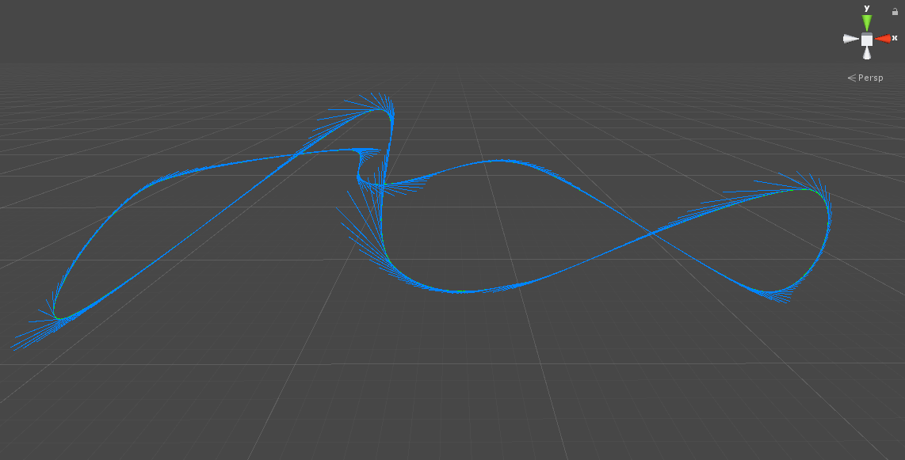

# Unity Catmull Rom Splines

**A clean Catmull-Rom splines implemenation for Unity.**

Algorithm implementation based on: [JPBotelho/Catmull-Rom-Splines](https://github.com/JPBotelho/Catmull-Rom-Splines/)

I've refactored JPBotelho's implementation of the Catmull-Rom Splines into a static class that has been encapsulated 
into its own .dll file with the new Assembly Definition feature of Unity 2018.

I felt that the algorithm is better suited abstracted away from any overly-specific Unity context and/or objects, and in stead I've built example monobehaviours that use the pure algorithm to give it that Unity-specific context.

This should help keep the algorithm protected from any project specific setup, and allow for easier porting between projects.

An example scene and scripts show how to use the code in a simple way.

I've also included a general purpose utility for running heavy work methods as coroutines that have a frame time budget, 
which can return results to the caller via delegates. This utility has also been encapsulated into its own .dll file using the Assembly Definition feature.

# Screenshots

## Spline

## Normals

## Tangents

## Control Points

## Spline Points

## Example SplineBehaviour.cs

## Example SplineVisualizer.cs

